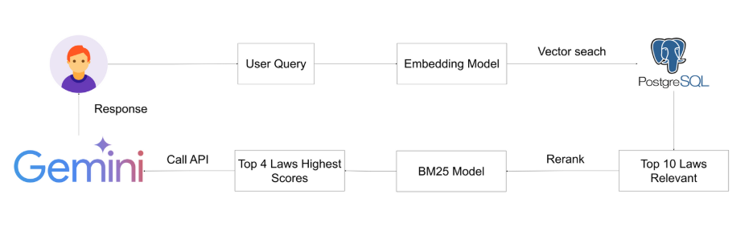

# legal-chatbot-VN-RAG
Legal Chatbot VN RAG là một chatbot hỗ trợ tư vấn pháp luật bằng tiếng Việt, sử dụng kỹ thuật Retrieval-Augmented Generation (RAG). Cơ sở dữ liệu được crawl trên trang pháp điển Việt Nam.

## 🚀 Công nghệ sử dụng  
- **Ngôn ngữ lập trình:** Python  
- **Mô hình embedding:** SimCSE-finetuned-Vietnamese-Legal-Documents  
- **Cơ sở dữ liệu:** PostgreSQL + pgvector  
- **Giao diện** Gradio 

